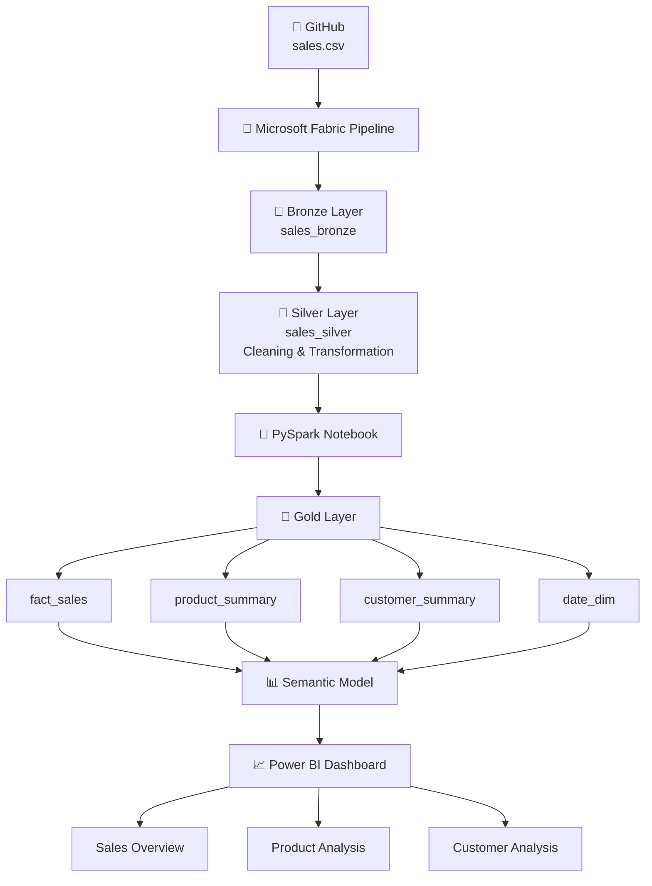

# 📊 Sales Analytics Project – Microsoft Fabric


## 📌 Projektübersicht

Dieses Projekt zeigt eine vollständige **End-to-End Sales Analytics Lösung** mit **Microsoft Fabric**.

Die Verkaufsdaten werden aus einer CSV-Datei geladen, mit einer automatisierten Pipeline verarbeitet, in der Medallion-Architektur transformiert und anschließend mit Power BI visualisiert.

Das Projekt demonstriert Data Engineering und Business Intelligence Prozesse von der Datenaufnahme bis zum Dashboard.

---

# 🏗️ Architektur



---

# 🛠️ Technologien

| Technologie | Verwendung |
|---|---|
| Microsoft Fabric | Cloud Data Platform |
| OneLake | Datenspeicherung |
| Data Pipeline | Datenintegration |
| Dataflow Gen2 | Datenbereinigung |
| PySpark | Transformation |
| Delta Lake | Tabellenverwaltung |
| Semantic Model | Datenmodellierung |
| Power BI | Dashboard & Reporting |
| GitHub | Versionskontrolle |

---

# 🔄 Datenprozess (ETL)

## 🥉 Bronze Layer

**sales_bronze**

- Laden der Rohdaten aus GitHub CSV
- Speicherung der Originaldaten

---

## 🥈 Silver Layer

**sales_silver**

Durchgeführte Transformationen:

✅ Prüfung auf Nullwerte  
✅ Entfernung von Duplikaten  
✅ Anpassung der Datentypen  
✅ Berechnung der Spalte `SalesAmount`

---

## 🥇 Gold Layer

Erstellung von Business-optimierten Tabellen:

### fact_sales
- Verkaufsdetails
- Umsatz
- Menge
- Produktinformationen

### product_summary
- Umsatz je Produkt
- Verkaufte Mengen

### customer_summary
- Umsatz je Kunde
- Anzahl Bestellungen

### date_dim
- Jahr
- Quartal
- Monat
- Zeitanalysen

---

# 📊 Power BI Dashboard

Das Dashboard besteht aus drei Seiten:

## 1️⃣ Sales Overview

Enthält:

- Total Revenue
- Total Orders
- Total Quantity
- Sales Trend nach Monat
- Sales nach Produkt


## 2️⃣ Product Analysis

Enthält:

- Total Revenue
- Total Products
- Top Products by Revenue
- Quantity Sold by Product


## 3️⃣ Customer Analysis

Enthält:

- Total Customers
- Customer Revenue
- Top Customers
- Orders by Customer

---

# 📸 Screenshots

## Pipeline


## Sales Dashboard


## Product Analysis


## Customer Analysis


---

# 📂 Repository Structure

```
Sales-Analytics-Fabric
│
├── sales.csv
│
├── pipeline
│   └── pipeline.png
│
├── notebook
│   └── Gold_Notebook.ipynb
│
├── powerbi
│   ├── sales_dashboard.png
│   ├── product_analysis.png
│   └── customer_analysis.png
│
└── README.md
```

---

# 🚀 Projektergebnisse

✅ End-to-End Datenpipeline  
✅ Medallion Architektur (Bronze/Silver/Gold)  
✅ Datenbereinigung mit Fabric  
✅ Transformation mit PySpark  
✅ Star Schema Datenmodell  
✅ Interaktives Power BI Dashboard  

---

# 👩‍💻 Autor

**Anitha Doddavula**

GitHub: https://github.com/doddavula
