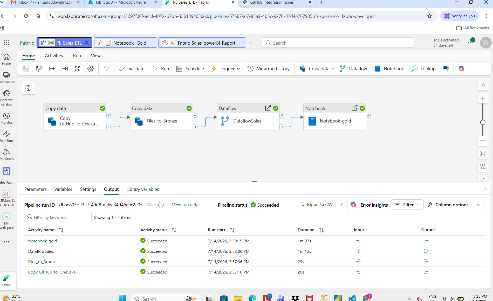
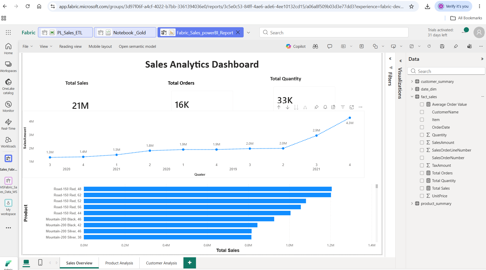
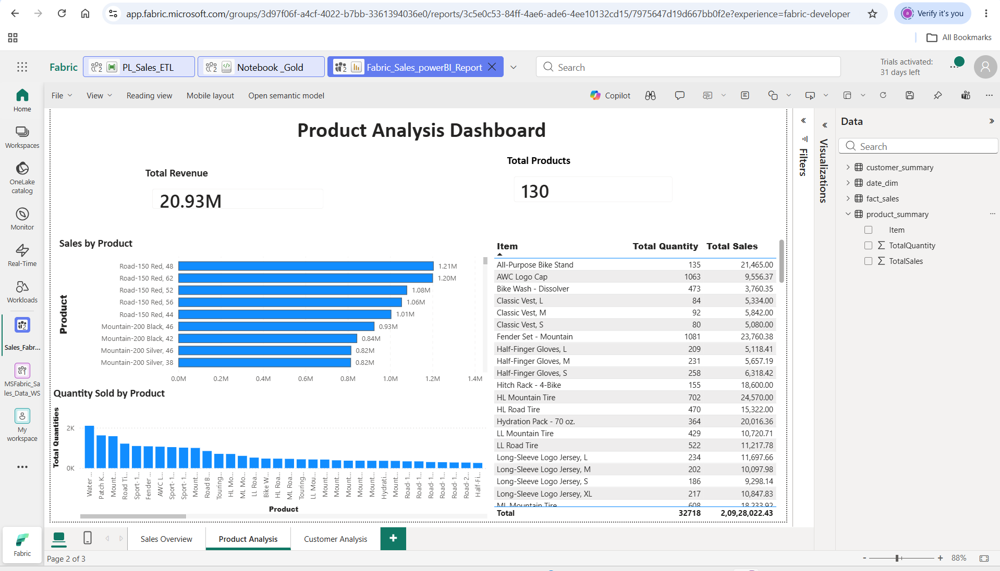
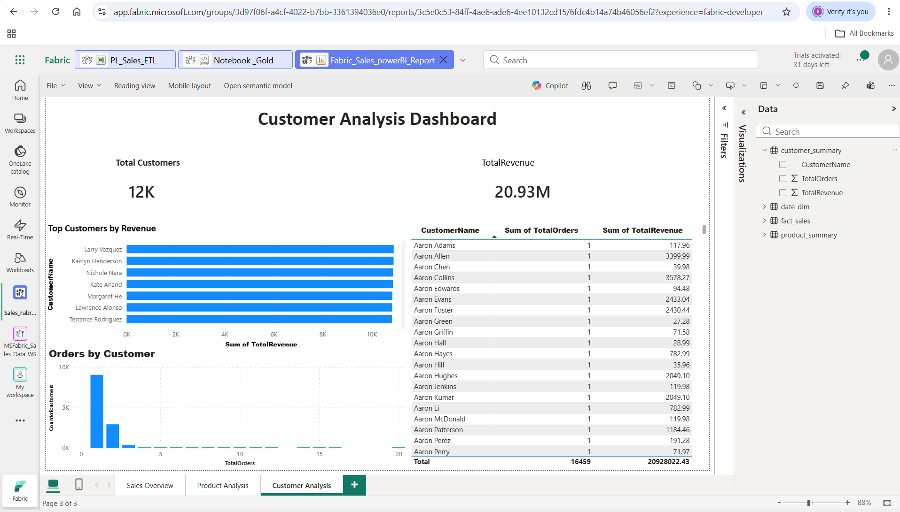

# 📊 Sales Analytics Projekt – Microsoft Fabric

## 📌 Projektübersicht

Dieses Projekt zeigt eine vollständige **End-to-End Sales Analytics Lösung mit Microsoft Fabric**.

Die Verkaufsdaten werden aus einer CSV-Datei geladen, verarbeitet und mit einer **Medallion-Architektur (Bronze, Silver, Gold)** für die Analyse vorbereitet.

Anschließend werden die aufbereiteten Daten mit einem **Power BI Dashboard** visualisiert und analysiert.

---

# 🛠️ Verwendete Technologien

- Microsoft Fabric
- OneLake
- Data Pipeline
- Dataflow Gen2
- PySpark Notebook
- Delta Lake
- Semantic Model
- Power BI
- GitHub

---

# 🏗️ Projektarchitektur


```text
GitHub
(sales.csv)
      |
      v
Microsoft Fabric Pipeline
      |
      v
Bronze Layer
(sales_bronze)
(Rohdaten)
      |
      v
Silver Layer
(sales_silver)
(Datenbereinigung)
      |
      v
PySpark Notebook
      |
      v
Gold Layer

- fact_sales
- product_summary
- customer_summary
- date_dim

      |
      v
Fabric Semantic Model
      |
      v
Power BI Dashboard
```

---

# 🔄 Datenverarbeitung (ETL-Prozess)

## 🥉 Bronze Layer

### Tätigkeiten:

- Import der CSV-Datei aus GitHub
- Speicherung der Rohdaten im Fabric Lakehouse

### Tabelle:


sales_bronze


---

## 🥈 Silver Layer

### Durchgeführte Transformationen:

✅ Prüfung auf Nullwerte  
✅ Entfernung von Duplikaten  
✅ Anpassung der Datentypen  
✅ Erstellung der Spalte `SalesAmount`  
✅ Datenbereinigung und Qualitätsprüfung  

### Tabelle:


sales_silver


---

## 🥇 Gold Layer (Business Data Model)

Erstellung von Business-Tabellen für Reporting und Analyse:

### fact_sales

Enthält:

- Verkaufsdaten
- Menge
- Preis
- Umsatz

---

### product_summary

Enthält:

- Umsatz je Produkt
- Verkaufte Mengen
- Produktperformance

---

### customer_summary

Enthält:

- Umsatz je Kunde
- Anzahl Bestellungen
- Kundenperformance

---

### date_dim

Enthält:

- Jahr
- Quartal
- Monat

---

# 📈 Power BI Dashboard

Das Dashboard besteht aus drei Seiten:

## 1. Sales Overview

Enthält:

- Gesamtumsatz
- Gesamtbestellungen
- Gesamtmenge
- Umsatzentwicklung nach Monat
- Umsatz nach Produkt

---

## 2. Product Analysis

Enthält:

- Gesamtumsatz
- Anzahl Produkte
- Top-Produkte nach Umsatz
- Verkaufte Menge je Produkt

---

## 3. Customer Analysis

Enthält:

- Anzahl Kunden
- Kundenumsatz
- Top-Kunden
- Bestellungen je Kunde

---

# 📸 Screenshots

## Microsoft Fabric Pipeline



---

## Sales Dashboard



---

## Product Analysis



---

## Customer Analysis



---

# 💡 Business Insights

Das Dashboard ermöglicht die Analyse von:

- Umsatzentwicklung über die Zeit
- Produktperformance
- Kundenverhalten
- Verkaufskennzahlen (KPIs)
- Top-Produkten und Top-Kunden

---

# 📂 Repository Struktur


Sales-Analytics-Fabric

│
├── sales.csv
│
├── pipeline
│ └── pipeline.png
│
├── notebook
│ └── Gold_Notebook.ipynb
│
├── powerbi
│ ├── sales_dashboard.png
│ ├── product_analysis.png
│ └── customer_analysis.png
│
└── README.md


---

# 🚀 Projektergebnisse

✅ Aufbau einer End-to-End Datenpipeline  
✅ Nutzung der Medallion-Architektur (Bronze, Silver, Gold)  
✅ Datenbereinigung und Transformation  
✅ Verarbeitung mit PySpark  
✅ Erstellung eines analytischen Datenmodells  
✅ Entwicklung interaktiver Power BI Dashboards  
✅ Integration von Microsoft Fabric Komponenten  

---

# 👩‍💻 Autor

**Anitha Doddavula**

GitHub:  
https://github.com/doddavula

